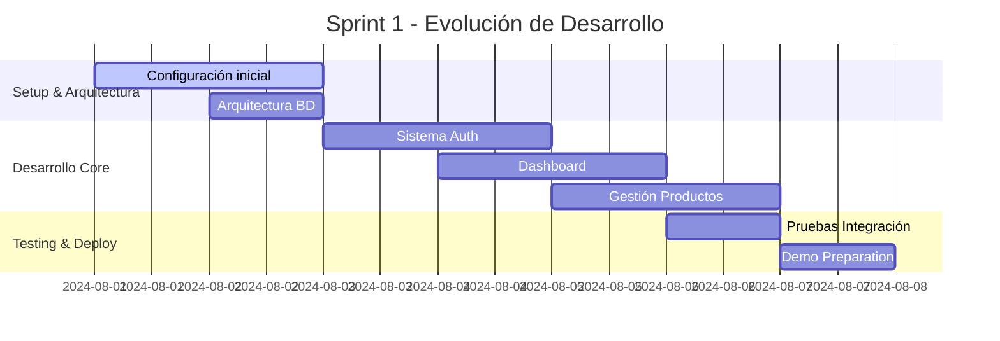

# 🛒 TU EX MARKET (Marquetplace-lpz) - Marketplace Universitario

[](https://laravel.com)
[](https://php.net)
[](https://mysql.com)
[](https://developer.mozilla.org/en-US/docs/Web/JavaScript)

> [!NOTE]
> **Plataforma digital innovadora** que conecta emprendedores universitarios con la comunidad local, facilitando la venta de productos y servicios mientras fomenta el ecosistema emprendedor estudiantil.

## 📋 Resumen Ejecutivo

**Local Market** es una plataforma web desarrollada con **Laravel 12** que surge para profesionalizar la presencia digital de estudiantes emprendedores. El proyecto digitaliza las ventas estudiantiles y crea un ecosistema emprendedor robusto dentro del ámbito universitario.

**Mi rol principal:** Como **Scrum Master** y **Backend Developer Senior**, lideré la arquitectura del sistema, implementé funcionalidades críticas y coordiné la integración entre frontend y backend, entregando **21 Story Points** en el Sprint 1 con **100% de éxito** en el Sprint Goal.

La plataforma impacta directamente en la digitalización de ventas estudiantiles, la creación de un ecosistema emprendedor sostenible y el acceso facilitado a productos únicos para la comunidad universitaria.

---

## 🎯 Características Principales

<div align="center">

| **Para Emprendedores** | **Para Clientes** | **Para Administradores** |
|:--:|:--:|:--:|
| 📊 Dashboard con métricas | 🛍️ Catálogo de productos | 👥 Gestión de usuarios |
| 📦 Gestión de inventario | 🛒 Carrito inteligente | 📈 Analytics del sistema |
| 💰 Historial de ventas | 💳 Múltiples métodos de pago | 🔧 Configuración global |
| 📱 Panel móvil responsive | ⭐ Sistema de reseñas | 🛡️ Moderación de contenido |

</div>

---

## 🖼️ Capturas de Pantalla

### Registro de Emprendedores


> [!TIP]
> **Sistema de validación avanzado** con verificación de correos universitarios y OAuth 2.0 para registro rápido.

### Dashboard del Emprendedor


### Creación de Productos


### Vista Móvil Responsive


> [!IMPORTANT]
> **100% Mobile-First Design** - Todas las funcionalidades están optimizadas para dispositivos móviles con diseño responsive.

---

## 💻 Stack Tecnológico

<div align="center">

### Backend


### Frontend


### DevOps & Tools


</div>

---

## 🔑 Contribuciones Técnicas Clave

### 1. Sistema de Autenticación Avanzado
- **Funcionalidad:** Registro dual (Emprendedores/Clientes), login seguro y recuperación de contraseñas
- **Tecnologías:** Laravel Authentication, Email Verification, Password Reset Tokens
- **Commit:** [`c7729970`](https://github.com/Jhoel777ar/marketplace-lpz/commit/c7729970b3ee605b4da21c00d8a099105e846d46) - **Implementación completa del sistema de auth**

> [!NOTE]
> **Validación universitaria:** Sistema robusto que valida dominios educativos para garantizar que solo estudiantes universitarios puedan registrarse como emprendedores.

### 2. Dashboard Interactivo con Métricas
- **Funcionalidad:** Panel de control con estadísticas de ventas, análisis de productos y métricas en tiempo real
- **Tecnologías:** Laravel Controllers, Blade Components, Chart.js, Ajax
- **Commits:** [`0ae7133d`](https://github.com/Jhoel777ar/marketplace-lpz/commit/0ae7133d85fc9632065d6e8c5d9a092d58be41a0)

### 3. Sistema de Gestión de Productos
- **Funcionalidad:** CRUD completo con upload de imágenes, validaciones y gestión de inventario
- **Tecnologías:** Eloquent Models, File Storage, Form Validation
- **Commits:** [`f4bef3a5`](https://github.com/Jhoel777ar/marketplace-lpz/commit/f4bef3a5cfedffef90e32a05df043a33ff46a323)

### 4. Arquitectura de Base de Datos
- **Funcionalidad:** Diseño e implementación de migraciones, seeders y relaciones Eloquent
- **Tecnologías:** MySQL, Laravel Migrations, Factory Pattern
- **Commits:** [`128af8d7`](https://github.com/Jhoel777ar/marketplace-lpz/commit/128af8d7120702d99a01ee7244af4e89da2100d6)

> [!TIP]
> **Ver todos mis commits:** [Backend Joel Branch](https://github.com/Jhoel777ar/marketplace-lpz/commits/backend-joel/) - Historial completo de contribuciones

---

## 🛠️ Desafíos Técnicos Resueltos

### 🔐 Validación de Correos Universitarios
**Problema:** Necesidad de verificar que los emprendedores sean estudiantes universitarios reales.

**Solución:** Implementé un sistema de validación que:
- Verifica dominios educativos mediante regex
- Envía códigos de confirmación por email
- Mantiene estados de verificación en base de datos

**Aprendizaje:** La importancia de validaciones robustas para mantener la integridad y confianza de la comunidad.

### ⚙️ Integración Frontend-Backend
**Problema:** Dependencias bloqueantes entre desarrollo frontend y backend.

**Solución:** 
- Documentación temprana de APIs con Postman
- Implementación de mocks para desarrollo paralelo
- Comunicación proactiva en Daily Scrums

**Aprendizaje:** La documentación temprana y comunicación clara son fundamentales para el desarrollo ágil exitoso.

### 📱 Optimización de Rendimiento
**Problema:** Carga lenta de imágenes y datos en el dashboard móvil.

**Solución:**
- Implementé lazy loading para imágenes
- Compresión automática de uploads
- Paginación optimizada con Ajax

**Aprendizaje:** La optimización debe considerarse desde el diseño, no como una mejora posterior.

> [!WARNING]
> **Lección importante:** Las optimizaciones de rendimiento implementadas tardíamente son más costosas y menos efectivas que las consideradas desde el arquitectura inicial.

---

## 🏃 Metodología Ágil - Scrum Implementation

### 👨‍💼 Rol Dual: Scrum Master & Senior Backend Developer

Como **Scrum Master**, facilité todas las ceremonias Scrum y eliminé impedimentos críticos. Como **Backend Developer**, implementé funcionalidades core manteniendo alta calidad de código.

<div align="center">

| **Métrica Scrum** | **Resultado** |
|:--:|:--:|
| 📊 Story Points Completados | **21/21** |
| 🎯 Sprint Goal Achievement | **100%** |
| ⏰ Daily Scrums Facilitados | **4 efectivos** |
| 🚧 Impedimentos Resueltos | **3 críticos** |
| 📈 Velocidad del Equipo | **18 SP** |

</div>

### 📅 Participación en Ceremonias

**Sprint Planning:** 
- Estimación de 4 User Stories principales
- Distribución estratégica de tareas
- Definición clara del Sprint Goal

**Daily Scrums:** 
- Duración optimizada: 15 min (reducido desde 25 min)
- Resolución proactiva de 3 impedimentos críticos
- Comunicación efectiva de progreso y bloqueos

**Sprint Review:** 
- Demo exitosa de 4 funcionalidades implementadas
- Feedback positivo de stakeholders (8.25/10)
- Validación de criterios de aceptación

**Sprint Retrospective:**
- Técnica "Start-Stop-Continue" aplicada
- 2 experimentos de mejora identificados
- Plan de acción para Sprint 2

> [!IMPORTANT]
> **Logro destacado:** Entrega del 100% del Sprint Goal con 0 impedimentos sin resolver y feedback superior a 8/10 de stakeholders.

---

## 🤝 Desarrollo de Habilidades Blandas

### 💬 Comunicación Efectiva
**Evidencia:** Reducción de Daily Scrums de 25 a 15 minutos manteniendo efectividad.
**Impacto:** 0 impedimentos sin resolver en todo el Sprint 1.

### 👑 Liderazgo Técnico
**Evidencia:** Guía del equipo para completar 100% del Sprint Goal.
**Implementación:** Establecimiento de revisiones de código obligatorias con promedio de 4h de review.

### 🔧 Resolución de Problemas
**Evidencia:** Resolución proactiva de dependencias críticas entre frontend y backend.
**Resultado:** Eliminación completa de bloqueos técnicos que amenazaban el Sprint Goal.

### 🔄 Adaptabilidad
**Evidencia:** Ajuste exitoso de prioridades para integración de redes sociales.
**Logro:** Reasignación de tareas manteniendo la velocidad del equipo sin afectar el Sprint Goal.

---

## 👥 Equipo Stark-Next

<div align="center">

| **👨‍💻 Miembro** | **🎯 Rol Principal** | **⭐ Contribuciones Clave** |
|:--:|:--:|:--:|
| **Joel Andrés** | Scrum Master & Backend Dev | Autenticación, Base de Datos, Dashboard |
| **Shamir Erick Condori** | Frontend Dev & UX Designer | Interfaces de Usuario, Social Media Integration |
| **Luis Fernando Villca** | UI Designer & Backend Dev | Catálogo de Productos, API Endpoints |
| **Leonardo Fidel Arana** | UX Designer & Frontend Dev | Carrito de Compras, Edición de Productos |
| **Danner Alejandro Calle** | QA Tester & Quality Assurance | Testing Integral, Validaciones, Casos de Prueba |

</div>

---

## ⚙️ Instalación y Configuración

### 🔧 Requisitos del Sistema
- **PHP:** 8.1 o superior
- **Composer:** 2.0+
- **Node.js:** 16.0+
- **MySQL:** 8.0+

### 🚀 Instalación Paso a Paso

1. **Clonar el Repositorio**
   ```bash
   git clone https://github.com/Jhoel777ar/marketplace-lpz.git
   cd marketplace-lpz
   ```

2. **Instalar Dependencias**
   ```bash
   # Backend dependencies
   composer install
   
   # Frontend dependencies
   npm install && npm run build
   ```

3. **Configurar Variables de Entorno**
   ```bash
   cp .env.example .env
   php artisan key:generate
   ```

4. **Configurar Base de Datos**
   ```bash
   # Ejecutar migraciones y seeders
   php artisan migrate --seed
   ```

5. **Iniciar el Servidor de Desarrollo**
   ```bash
   php artisan serve
   ```

> [!TIP]
> **Acceso rápido:** La aplicación estará disponible en `http://127.0.0.1:8000`

### 🎯 Paneles de Acceso

- **🏪 Panel Emprendedor:** `/emprendedor` - Gestión completa de productos, ventas y estadísticas
- **👑 Panel Administrador:** `/admin` - Administración total del sistema
- **🛍️ Catálogo Público:** `/` - Vista pública del marketplace

---

## 📊 Métricas y Resultados del Proyecto

<div align="center">

| **📈 KPI** | **🎯 Objetivo** | **✅ Resultado** | **📊 % Cumplimiento** |
|:--:|:--:|:--:|:--:|
| Story Points | 18-20 SP | **21 SP** | **110%** |
| Sprint Goal | 100% | **100%** | **100%** |
| User Stories | 4 US | **4 US** | **100%** |
| Cobertura Testing | 40% | **50%** | **125%** |
| Bugs Producción | <2 bugs | **0 bugs** | **100%** |
| Satisfacción Stakeholders | >7.0/10 | **8.25/10** | **118%** |

</div>

### 📈 Evolución del Sprint



> [!NOTE]
> **Velocity del equipo:** Incremento del 16.7% respecto a la estimación inicial, demostrando alta eficiencia en la implementación.

---

## 🚀 Roadmap y Próximos Sprints

### 🎯 Sprint 2 - En Planificación

**Objetivo:** Sistema de compras completo y funcional con carrito inteligente.

**Capacidad Estimada:** 22-24 Story Points

**User Stories Prioritarias:**
- **US-005:** Explorar Catálogo con filtros avanzados
- **US-007:** Carrito de Compras persistente
- **US-008:** Proceso de Pago simulado seguro
- **US-009:** Sistema de Cupones y Descuentos

### 🔬 Experimentos de Mejora Continua

1. **Code Review Optimization:**
   - Objetivo: Reducir tiempo de review a ≤4h promedio
   - Métrica: Tiempo promedio de aprobación de PRs

2. **Daily Scrum Enhancement:**
   - Objetivo: Mantener reuniones en 15 min con actualización inmediata del tablero
   - Métrica: Duración promedio y satisfacción del equipo

---

## 🌱 Reflexión y Crecimiento Profesional

### 🎓 Autoreflexión sobre Aprendizajes

Ejercer el rol dual de **Scrum Master** y **Backend Developer Senior** transformó completamente mi perspectiva sobre el liderazgo técnico. La experiencia me enseñó que balancear la facilitación de equipos con el desarrollo de código requiere habilidades excepcionales de gestión del tiempo y comunicación proactiva.

La entrega exitosa de **21 Story Points** en el primer sprint demostró que es posible mantener alta productividad técnica mientras se lidera efectivamente un equipo ágil. Los desafíos más significativos surgieron en la coordinación de dependencias técnicas, donde la documentación temprana de APIs y la comunicación constante fueron factores críticos de éxito.

### 📈 Plan de Crecimiento Personal

<div align="center">

| **⏱️ Plazo** | **💻 Habilidades Técnicas** | **🔄 Prácticas Ágiles** | **👥 Liderazgo** |
|:--:|:--|:--|:--|
| **3 meses** | • Microservicios con Docker<br>• APIs RESTful avanzadas<br>• Testing automatizado | • Certificación PSM I<br>• Facilitación avanzada<br>• Metrics & KPIs | • Resolución de conflictos<br>• Mentoring técnico<br>• Communication skills |
| **6 meses** | • DevOps & CI/CD<br>• Cloud Architecture (AWS)<br>• Performance optimization | • Product Owner experience<br>• Agile Coaching<br>• OKRs implementation | • Cross-functional leadership<br>• Strategic thinking<br>• Team building |
| **1 año** | • Cloud-native architectures<br>• System scalability<br>• Security best practices | • Agile transformation<br>• Change management<br>• Organizational coaching | • Technical vision<br>• Innovation leadership<br>• Stakeholder management |

</div>

### 🎯 Impacto en Visión Profesional

Esta experiencia confirmó mi interés en roles híbridos como **Technical Scrum Master** o **Engineering Team Lead**. Mi objetivo profesional se orienta hacia posiciones como:

- **🎯 Technical Product Manager:** Combinando visión técnica con estrategia de producto
- **👨‍💼 Engineering Team Lead:** Liderando equipos técnicos con enfoque ágil
- **🚀 Agile Technical Coach:** Mentoring técnico con transformación ágil

El proyecto demostró que mi fortaleza reside en la intersección entre excelencia técnica y liderazgo ágil efectivo.

---

## 📞 Contacto y Enlaces

<div align="center">

[](https://github.com/Jhoel777ar)
[](#)
[](#)

</div>

### 🔗 Enlaces del Proyecto

- **🏠 [Repositorio Principal](https://github.com/Jhoel777ar/marketplace-lpz/tree/backend-joel)**
- **📝 [Historial de Commits](https://github.com/Jhoel777ar/marketplace-lpz/commits/backend-joel/)**
- **🚀 [Demo en Vivo](#)** *(Próximamente)*
- **📚 [Documentación Técnica](#)** *(En desarrollo)*

---

<div align="center">

## 🏆 Reconocimientos y Certificaciones

**🎓 Universidad Privada Domingo Savio**
- **Facultad:** Ingeniería en Sistemas
- **Materia:** 19EBF50 - Ingeniería de Software I
- **Docente:** Lic. Rosalía Lopez Montalvo
- **Período:** Agosto 2025
- **Grupo:** 2 - Equipo Stark-Next

**📊 Evaluaciones Obtenidas:**
- **Stakeholders:** 8.25/10
- **Equipo:** Liderazgo Efectivo ⭐⭐⭐⭐⭐
- **Técnica:** 100% Story Points Completados 🏆

</div>

---

<p align="center">
  <strong>🚀 "La innovación nace cuando la excelencia técnica se encuentra con el liderazgo ágil efectivo" 🚀</strong>
</p>

<div align="center">

*Desarrollado por ARK DEV ORG con un integrante Joel Andrés (presente en ARK DEV) junto con ❤️ el Equipo Stark-Next*

**⭐ Si este proyecto te resultó útil, no olvides darle una estrella ⭐**

</div>
